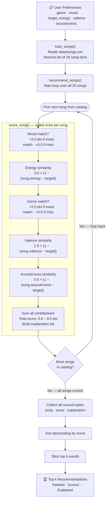

# 🎵 Reliability-Aware Music Recommender

## Project Summary

This project is a content-based AI music recommender that explains why each song was selected and now also audits how reliable those recommendations are. The system scores songs against a listener profile, then runs a built-in stability check by slightly perturbing the profile and measuring whether the same songs still appear near the top. That reliability signal is folded back into ranking and shown in the final explanation, so the application does more than recommend songs: it also tells you when its answers are stable and when they should be treated cautiously.

---

## How The System Works

Real-world recommenders like Spotify and YouTube combine two strategies: collaborative filtering, which surfaces songs that users with similar taste histories have enjoyed, and content-based filtering, which matches songs by their audio attributes — things like energy, tempo, or mood. In practice, platforms layer both approaches together and add context signals like time of day or device type to refine results further. This simulation focuses on the content-based half of that equation. Rather than tracking what other users do, it builds a taste profile from a single user's preferred genre, mood, and target energy level, then scores every song in the catalog by how closely its attributes match those preferences. Each numerical attribute (energy, valence, acousticness) is scored using proximity — songs closer to the user's target receive higher marks — while categorical attributes (genre, mood) use an exact-match rule. The five feature scores are combined into a point total, with mood and energy carrying the most weight because they best capture the "vibe" a listener is after in a given moment. The songs are then ranked by total score and the top results are returned as recommendations. This makes the system transparent and easy to reason about: every recommendation can be explained by pointing to exactly which features matched and by how much.

---

### Algorithm Recipe

### Integrated AI Reliability System

The recommender includes a reliability layer inside the main application flow, not as a separate script.

- Before returning results, the app generates nearby versions of the user profile by nudging energy, valence, acousticness, popularity, mood intensity, and complexity.
- It re-scores the entire catalog for each nearby profile and measures how often each recommendation survives those perturbations.
- Songs that remain strong across the audit earn a stability bonus in the final ranking.
- Songs that fluctuate heavily are still shown when relevant, but their explanations are marked as lower-confidence.
- The CLI prints a reliability summary with guardrail warnings, stable-result ratio, and average stability.

This acts as a simple testing system for the AI logic because it checks recommendation consistency before the app commits to an answer.

**Inputs:** one `UserProfile` (genre, mood, target_energy, target_valence, target_acousticness) and one `Song` dict per evaluation.

**Step 1 — Mood (categorical, +3.0 pts)**
Award the full 3.0 points if `song.mood` exactly equals the user's target mood; otherwise award zero. Mood carries the highest single value because it is the most context-sensitive signal — a listener who wants something "chill right now" should get chill songs even if they cross genre lines.

**Step 2 — Energy similarity (numerical, up to +2.0 pts)**
```
energy_pts = 2.0 × (1 − |song.energy − target_energy|)
```
Energy spans 0.22–0.97 across the catalog — the widest perceptual spread of any feature. Proximity scoring means a song 0.50 away from the target earns only 1.0 pt, not a flat bonus. Wrong energy feels immediately wrong to a listener regardless of everything else.

**Step 3 — Genre (categorical, +2.0 pts)**
Award 2.0 points for an exact genre match; otherwise zero. Genre ranks below mood because it is an identity label, not an in-the-moment feeling — a jazz fan might love an ambient track when studying, even though the genres differ.

**Step 4 — Valence similarity (numerical, up to +1.5 pts)**
```
valence_pts = 1.5 × (1 − |song.valence − target_valence|)
```
Valence separates the edge cases that energy and genre cannot: a high-energy happy song (pop, valence 0.84) vs. a high-energy angry song (metal, valence 0.25) look identical to a mood+energy scorer. Valence catches the emotional color difference.

**Step 5 — Acousticness similarity (numerical, up to +0.5 pts)**
```
acoustic_pts = 0.5 × (1 − |song.acousticness − target_acousticness|)
```
Acousticness distinguishes organic/quiet texture from synthetic/loud texture. It is a refining signal rather than a deciding one — hence the smallest point ceiling.

**Base score:** 0.0 – 12.5 pts. After scoring, the app adds a small stability bonus based on the reliability audit so that brittle recommendations do not outrank more dependable ones by accident.

---

### Known Biases and Limitations

This system is transparent and simple, but that simplicity creates predictable failure modes worth knowing before interpreting results.

**1. Exact-match penalty for near-synonym moods**
The scorer awards full points or zero points for mood and genre — there is no partial credit. A user who wants "relaxed" songs will score zero on "chill" songs, even though those moods are nearly identical in practice. This makes the system brittle when the user's vocabulary does not exactly match the catalog's labels.

**2. Genre monopoly in a small catalog**
With 17 unique genres across 20 songs, most genres appear exactly once. A +2.0 genre bonus is effectively a named-song bonus — it almost always picks one specific track rather than a family of similar songs. In a real catalog of millions, genre is a broad filter; here it is a near-exact pointer.

**3. Implicit valence default favors moderately positive songs**
When a user profile omits `target_valence`, the scorer defaults to 0.65 — a mildly positive value. This silently penalizes very sad songs (classical, country) and very euphoric songs (k-pop) without the user asking for it. A user who does not know to set valence will unknowingly receive a mid-valence-biased list.

**4. No diversity enforcement — top results can cluster**
The ranking picks the k highest scores with no penalty for repetition. For a "lofi/focused" profile, all three top spots are lofi songs by the same two artists. A real system would enforce diversity by suppressing the same artist or genre from appearing more than once in a short list.

**5. Context blindness**
The system has no concept of time of day, current activity, listening history, or how many times a song has already been played. A real recommender would down-rank recently played songs and adjust for context (workout vs. bedtime). This system would recommend the same list every single time for the same profile.

---

## Data Flow

**Written map:**

```
INPUT              PROCESS                          OUTPUT
─────────────────  ───────────────────────────────  ──────────────────────
User Preferences   load_songs()                     Top k Recommendations
genre              reads data/songs.csv         ┐   ranked by total score
mood          ───► returns 20 song dicts         │   with explanations
target_energy      recommend_songs()             │
target_valence     loops over every song         │
target_acoustic      ↳ score_song() per song     │
                       mood match?   +3.0 pts    │
                       energy prox   +0–2.0 pts  │
                       genre match?  +2.0 pts    │
                       valence prox  +0–1.5 pts  │
                       acoustic prox +0–0.5 pts  ├──► song · score · reason
                     collect all scored tuples   │
                     sort descending by score    │
                     slice top k              ───┘
```

**Mermaid flowchart:**



---

## Getting Started

### Setup

1. Create a virtual environment (optional but recommended):

   ```bash
   python -m venv .venv
   source .venv/bin/activate      # Mac or Linux
   .venv\Scripts\activate         # Windows

2. Install dependencies:

```bash
pip install -r requirements.txt
```

3. Run the app:

```bash
python src/main.py
```

4. Optional: list the built-in profiles:

```bash
python src/main.py --list
```

5. Optional: run a specific profile:

```bash
python src/main.py chill_lofi
```

### Sample Output

Default profile: `pop_happy` (genre=pop, mood=happy, energy=0.80)

```
Loaded songs: 20
============================================================
  Music Recommender Simulation
  Profile : pop_happy
  genre=pop  |  mood=happy  |  energy=0.8
============================================================

  Top 5 Recommendations
------------------------------------------------------------

  #1  Sunrise City  —  Neon Echo
       Score : 8.96 / 9.0 pts
       Why   :
         +3.0 mood matches 'happy'
         +1.96 energy similarity (song 0.82, target 0.80)
         +2.0 genre matches 'pop'
         +1.50 valence similarity (song 0.84, target 0.84)
         +0.50 acousticness similarity (song 0.18, target 0.18)

  #2  Rooftop Lights  —  Indigo Parade
       Score : 6.79 / 9.0 pts
       Why   :
         +3.0 mood matches 'happy'
         +1.92 energy similarity (song 0.76, target 0.80)
         +1.46 valence similarity (song 0.81, target 0.84)
         +0.42 acousticness similarity (song 0.35, target 0.18)

  #3  Gym Hero  —  Max Pulse
       Score : 5.57 / 9.0 pts
       Why   :
         +1.74 energy similarity (song 0.93, target 0.80)
         +2.0 genre matches 'pop'
         +1.40 valence similarity (song 0.77, target 0.84)
         +0.43 acousticness similarity (song 0.05, target 0.18)

  #4  Paloma Del Sol  —  Conjunto Vivo
       Score : 3.88 / 9.0 pts
       Why   :
         +1.96 energy similarity (song 0.78, target 0.80)
         +1.48 valence similarity (song 0.85, target 0.84)
         +0.43 acousticness similarity (song 0.31, target 0.18)

  #5  Neon Seoul  —  Starfall K
       Score : 3.75 / 9.0 pts
       Why   :
         +1.84 energy similarity (song 0.88, target 0.80)
         +1.42 valence similarity (song 0.89, target 0.84)
         +0.48 acousticness similarity (song 0.15, target 0.18)

============================================================
```

### Logging and Guardrails

- The app logs catalog loading and recommendation runs with Python's built-in `logging` module.
- Invalid numeric profile targets are clamped into safe ranges instead of silently producing nonsense scores.
- Missing catalog files, malformed CSV rows, empty catalogs, and invalid `k` values raise explicit errors.
- If a requested genre or mood is not present in the catalog, the app warns the user and explains that it is falling back to weaker signals.

### Running Tests

Run the test suite with:

```bash
pytest
```

The tests cover:

- ranking behavior
- explanation generation
- integrated reliability reporting
- guardrail handling for unsupported profiles and invalid inputs

You can add more tests in `tests/test_recommender.py`.

---

## Experiments You Tried

Run any profile with:
```bash
python src/main.py <profile_name>
python src/main.py --list          # show all profiles
```

---

### Standard Profile 1 — `high_energy_pop`

**Expectation:** Sunrise City (pop/happy, energy=0.82) should rank first — it matches genre, mood, and is close on all numericals.

```
Loaded songs: 20

============================================================
  Music Recommender Simulation
  Profile : high_energy_pop
  genre=pop  |  mood=happy  |  energy=0.9
============================================================

  Top 5 Recommendations
------------------------------------------------------------

  #1  Sunrise City  —  Neon Echo
       Score : 8.78 / 9.0 pts
       Why   :
         +3.0 mood matches 'happy'
         +1.84 energy similarity (song 0.82, target 0.90)
         +2.0 genre matches 'pop'
         +1.48 valence similarity (song 0.84, target 0.85)
         +0.45 acousticness similarity (song 0.18, target 0.08)

  #2  Rooftop Lights  —  Indigo Parade
       Score : 6.53 / 9.0 pts
       Why   :
         +3.0 mood matches 'happy'
         +1.72 energy similarity (song 0.76, target 0.90)
         +1.44 valence similarity (song 0.81, target 0.85)
         +0.36 acousticness similarity (song 0.35, target 0.08)

  #3  Gym Hero  —  Max Pulse
       Score : 5.80 / 9.0 pts
       Why   :
         +1.94 energy similarity (song 0.93, target 0.90)
         +2.0 genre matches 'pop'
         +1.38 valence similarity (song 0.77, target 0.85)
         +0.48 acousticness similarity (song 0.05, target 0.08)

  #4  Neon Seoul  —  Starfall K
       Score : 3.87 / 9.0 pts

  #5  Gold Chain Gospel  —  Street Almanac
       Score : 3.69 / 9.0 pts

============================================================
```

**What happened:** Sunrise City wins easily (8.78). Rooftop Lights ranks #2 despite being "indie pop" — the happy mood match (+3.0) overrides the genre miss. Gym Hero ranks #3 because it misses mood (intense ≠ happy), losing all 3.0 pts instantly. Confirms that mood is the dominant signal.

---

### Standard Profile 2 — `chill_lofi`

**Expectation:** Library Rain and Midnight Coding should dominate — both are lofi/chill.

```
============================================================
  Music Recommender Simulation
  Profile : chill_lofi
  genre=lofi  |  mood=chill  |  energy=0.38
============================================================

  Top 5 Recommendations
------------------------------------------------------------

  #1  Library Rain  —  Paper Lanterns
       Score : 8.88 / 9.0 pts
       Why   :
         +3.0 mood matches 'chill'
         +1.94 energy similarity (song 0.35, target 0.38)
         +2.0 genre matches 'lofi'
         +1.47 valence similarity (song 0.60, target 0.58)
         +0.47 acousticness similarity (song 0.86, target 0.80)

  #2  Midnight Coding  —  LoRoom
       Score : 8.85 / 9.0 pts
       Why   :
         +3.0 mood matches 'chill'
         +1.92 energy similarity (song 0.42, target 0.38)
         +2.0 genre matches 'lofi'
         +1.47 valence similarity (song 0.56, target 0.58)
         +0.45 acousticness similarity (song 0.71, target 0.80)

  #3  Spacewalk Thoughts  —  Orbit Bloom
       Score : 6.63 / 9.0 pts
       Why   :
         +3.0 mood matches 'chill'
         +1.80 energy similarity (song 0.28, target 0.38)
         +1.40 valence similarity (song 0.65, target 0.58)
         +0.44 acousticness similarity (song 0.92, target 0.80)

  #4  Focus Flow  —  LoRoom   Score : 5.93
  #5  Willow and Wire  —  June Sparrow   Score : 3.77

============================================================
```

**What happened:** Library Rain and Midnight Coding are nearly tied (8.88 vs 8.85) — a difference of only 0.03 pts driven entirely by their energy distance from the 0.38 target. Spacewalk Thoughts ranks #3 by mood alone (chill match) despite wrong genre. Focus Flow (#4) scores lower because its mood is "focused," not "chill," losing the full 3.0-pt mood bonus.

---

### Standard Profile 3 — `deep_intense_rock`

**Expectation:** Storm Runner (rock/intense, energy=0.91) should be a near-perfect match.

```
============================================================
  Music Recommender Simulation
  Profile : deep_intense_rock
  genre=rock  |  mood=intense  |  energy=0.92
============================================================

  Top 5 Recommendations
------------------------------------------------------------

  #1  Storm Runner  —  Voltline
       Score : 8.94 / 9.0 pts
       Why   :
         +3.0 mood matches 'intense'
         +1.98 energy similarity (song 0.91, target 0.92)
         +2.0 genre matches 'rock'
         +1.46 valence similarity (song 0.48, target 0.45)
         +0.50 acousticness similarity (song 0.10, target 0.10)

  #2  Gym Hero  —  Max Pulse
       Score : 6.47 / 9.0 pts
       Why   :
         +3.0 mood matches 'intense'
         +1.98 energy similarity (song 0.93, target 0.92)
         +1.02 valence similarity (song 0.77, target 0.45)
         +0.47 acousticness similarity (song 0.05, target 0.10)

  #3  Iron Cathedral  —  Grave Circuit   Score : 3.59
  #4  Night Drive Loop  —  Neon Echo     Score : 3.54
  #5  Club Afterglow  —  Tessera         Score : 3.50

============================================================
```

**What happened:** Storm Runner scores 8.94 — almost perfect. Gym Hero ranks #2 because it shares mood=intense (+3.0) and energy is extremely close, but valence (0.77 vs target 0.45) costs 0.48 pts. Iron Cathedral (#3) has no mood or genre match — it survives on energy+valence proximity alone.

---

### Adversarial Profile 1 — `sad_banger`

**Design:** mood=sad + energy=0.92 are contradictory. genre=metal means no song in the catalog is metal+sad.

```
============================================================
  Music Recommender Simulation
  Profile : sad_banger
  genre=metal  |  mood=sad  |  energy=0.92
============================================================

  Top 5 Recommendations
------------------------------------------------------------

  #1  Iron Cathedral  —  Grave Circuit
       Score : 5.90 / 9.0 pts
       Why   :
         +1.90 energy similarity (song 0.97, target 0.92)
         +2.0 genre matches 'metal'
         +1.50 valence similarity (song 0.25, target 0.25)
         +0.50 acousticness similarity (song 0.08, target 0.08)

  #2  Heartbreak Porch  —  Dusty Hollow
       Score : 5.55 / 9.0 pts
       Why   :
         +3.0 mood matches 'sad'
         +0.98 energy similarity (song 0.41, target 0.92)
         +1.41 valence similarity (song 0.31, target 0.25)
         +0.16 acousticness similarity (song 0.76, target 0.08)

  #3  Storm Runner  —  Voltline   Score : 3.62
  #4  Night Drive Loop  —  Neon Echo   Score : 3.23
  #5  Club Afterglow  —  Tessera   Score : 3.19

============================================================
```

**The trick exposed:** Iron Cathedral (angry metal) ranks #1 over Heartbreak Porch (the only sad song) — 5.90 vs 5.55. The mood=sad signal (+3.0) for Heartbreak Porch is almost entirely wiped out by the energy mismatch penalty: asking for energy=0.92 but the song is 0.41 costs 1.02 pts in energy alone, plus 0.34 pts on acousticness. The genre+valence match on Iron Cathedral compensates enough to beat the actual sad song. The system cannot resolve this contradiction — no song in the catalog is simultaneously high-energy and sad.

---

### Adversarial Profile 2 — `ghost_genre`

**Design:** genre=bluegrass does not exist in the catalog. The +2.0 genre bonus is permanently unavailable. Max achievable score drops from 9.0 to 7.0.

```
============================================================
  Music Recommender Simulation
  Profile : ghost_genre
  genre=bluegrass  |  mood=chill  |  energy=0.35
============================================================

  Top 5 Recommendations
------------------------------------------------------------

  #1  Library Rain  —  Paper Lanterns
       Score : 6.94 / 9.0 pts

  #2  Spacewalk Thoughts  —  Orbit Bloom
       Score : 6.75 / 9.0 pts

  #3  Midnight Coding  —  LoRoom
       Score : 6.72 / 9.0 pts

  #4  Willow and Wire  —  June Sparrow   Score : 3.89
  #5  Focus Flow  —  LoRoom             Score : 3.85

============================================================
```

**The trick exposed:** The top-3 results (6.94, 6.75, 6.72) are nearly identical — separated by only 0.22 pts. Without the genre signal, the ranking collapses to mood+energy+valence. A tiny energy difference (Library Rain 0.35 = perfect match, Midnight Coding 0.42 = 0.07 away) is now the deciding factor between #1 and #3. There is a hard cliff between #3 (6.72) and #4 (3.89) — caused by the loss of the mood match for songs with moods other than "chill."

---

### Adversarial Profile 3 — `neutral_listener`

**Design:** All numerical targets at 0.5 — the midpoint of every scale. No song scores very high or very low on any numerical feature. Only categorical matches can separate the pack.

```
============================================================
  Music Recommender Simulation
  Profile : neutral_listener
  genre=ambient  |  mood=relaxed  |  energy=0.5
============================================================

  Top 5 Recommendations
------------------------------------------------------------

  #1  Coffee Shop Stories  —  Slow Stereo
       Score : 6.46 / 9.0 pts
       Why   :
         +3.0 mood matches 'relaxed'
         +1.74 energy similarity (song 0.37, target 0.50)
         +1.41 valence similarity (song 0.71, target 0.65)
         +0.30 acousticness similarity (song 0.89, target 0.50)

  #2  Spacewalk Thoughts  —  Orbit Bloom
       Score : 5.35 / 9.0 pts
       Why   :
         +1.56 energy similarity (song 0.28, target 0.50)
         +2.0 genre matches 'ambient'
         +1.50 valence similarity (song 0.65, target 0.65)
         +0.29 acousticness similarity (song 0.92, target 0.50)

  #3  Midnight Coding  —  LoRoom   Score : 3.60
  #4  Focus Flow  —  LoRoom        Score : 3.57
  #5  Velvet Hours  —  Sable & Rose Score : 3.50

============================================================
```

**The trick exposed:** Coffee Shop Stories wins on mood alone (+3.0). Spacewalk Thoughts wins on genre alone (+2.0). After those two categorical winners, #3–#5 are separated by only 0.10 pts — their scores are nearly identical because every numerical target at 0.5 gives all mid-range songs a near-equal proximity score. The system produces a valid ranking but it has very low confidence — the bottom four results are essentially a coin flip.

---

## Limitations and Risks

Summarize some limitations of your recommender.

Examples:

- It only works on a tiny catalog
- It does not understand lyrics or language
- It might over favor one genre or mood

You will go deeper on this in your model card.

---

## Reflection

Read and complete `model_card.md`:

[**Model Card**](model_card.md)

Write 1 to 2 paragraphs here about what you learned:

- about how recommenders turn data into predictions
- about where bias or unfairness could show up in systems like this


---

## 7. `model_card_template.md`

Combines reflection and model card framing from the Module 3 guidance. :contentReference[oaicite:2]{index=2}  

```markdown
# 🎧 Model Card - Music Recommender Simulation

## 1. Model Name

Give your recommender a name, for example:

> VibeFinder 1.0

---

## 2. Intended Use

- What is this system trying to do
- Who is it for

Example:

> This model suggests 3 to 5 songs from a small catalog based on a user's preferred genre, mood, and energy level. It is for classroom exploration only, not for real users.

---

## 3. How It Works (Short Explanation)

Describe your scoring logic in plain language.

- What features of each song does it consider
- What information about the user does it use
- How does it turn those into a number

Try to avoid code in this section, treat it like an explanation to a non programmer.

---

## 4. Data

Describe your dataset.

- How many songs are in `data/songs.csv`
- Did you add or remove any songs
- What kinds of genres or moods are represented
- Whose taste does this data mostly reflect

---

## 5. Strengths

Where does your recommender work well

You can think about:
- Situations where the top results "felt right"
- Particular user profiles it served well
- Simplicity or transparency benefits

---

## 6. Limitations and Bias

Where does your recommender struggle

Some prompts:
- Does it ignore some genres or moods
- Does it treat all users as if they have the same taste shape
- Is it biased toward high energy or one genre by default
- How could this be unfair if used in a real product

---

## 7. Evaluation

How did you check your system

Examples:
- You tried multiple user profiles and wrote down whether the results matched your expectations
- You compared your simulation to what a real app like Spotify or YouTube tends to recommend
- You wrote tests for your scoring logic

You do not need a numeric metric, but if you used one, explain what it measures.

---

## 8. Future Work

If you had more time, how would you improve this recommender

Examples:

- Add support for multiple users and "group vibe" recommendations
- Balance diversity of songs instead of always picking the closest match
- Use more features, like tempo ranges or lyric themes

---

## 9. Personal Reflection

A few sentences about what you learned:

- What surprised you about how your system behaved
- How did building this change how you think about real music recommenders
- Where do you think human judgment still matters, even if the model seems "smart"
